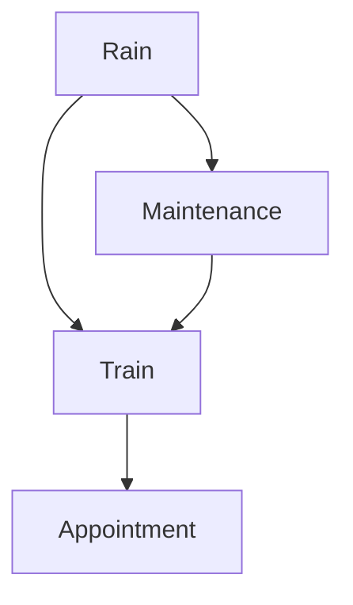

# uncertainty

## some words to know
| words      | meanings |
|------------|----------|
| succinctly | 间接地   |

## 概率

### 概率公理
- $0 < p(\omega) < 1$ 
- 所有事件发生的可能性加起来等于1

### 无条件概率

每一个事件都是相互独立的

### 条件概率

条件概率是基于某种事件对某一个事情的可信度判断

条件概率使用以下公式表示
$$
P(a | b)
$$
它意味着，已知b事件发生的情况下，a事件发生的概率。为了计算条件概率，我们
可以使用以下公式
$$
P(a | b) = \frac{P(a \wedge b)}{P(b)} 
$$
如果使用文字来描述这个公式，就是：

已知b事件发生的情况下，a事件发生的概率 等于 a, b事件同时发生的概率
除以b事件单独发生的概率。假设概率都不为0，我们可以推出下列公式
$$
P(a \wedge b) = P(b)P(a|b) \\
P(a \wedge b) = P(a)P(b|a)
$$

## 随机变量
A random variable is a variable in probability
theory with a domain of possible values that it can take on.

### 独立性
独立性是某一个事件的发生不会对其他事件造成影响

### 贝叶斯定理
在概率论领域，贝叶斯定理被广泛运用于计算条件概率。
$$
P(b|a) = \frac{P(b)P(a|b)}{P(a)}
$$

比如说，我们想要计算如果早上有云，那么下午下雨的概率是多少or$P(rain|clouds)$ 
假设我们有以下信息
- $P(clouds | rain) = 0.8$
-  $P(clouds) = 0.4$ 
-  $P(rain) = 0.1$
Then
 $P(rain | cloud) = \frac{P(rain) P(clouds|rain)}{P(clouds)}$ 

知道$P(a | b)$和$P(a), P(b)$ 我们可以计算出$P(b | a)$ 

## 联合概率分布

联合概率分布是多个事件发生的可能性
我们考虑一个例子

| event        | probability |
|--------------|-------------|
| cloud        | $0.4$       |
| $\neg cloud$ | $0.6$       |

| event       | probability |
|-------------|-------------|
| rain        | $0.1$       |
| $\neg rain$ | $0.9$       |

他们的联合分布是
|             | cloud | $\neg$ cloud |
|-------------|-------|--------------|
| rain        | 0.08  | 0.02         |
| $\neg$ rain | 0.32  | 058          |

--------

## Probability Rules
- Negation 
- Inclusion-Exclusion 容斥
- Marginalization 边缘概率分布？
    $$
    P(X = x_i) = \sum_{j=1} P(X = x_i, Y = y_j)
    $$
    用文字描述就是：随机变量$X$ 取$x_i$ 值的概率会等于$x_i$ 与 随机变量$Y$ 
    的所有取值的联合概率之和
- Conditioning
    $$
    P(X = x_i) = \sum_{j=1} P(X = x_i | Y = y_j) P(Y = y_j)
    $$
    用文字描述就是：随机变量$X$ 取$x_i$ 值的概率会等于$x_i$ 与 随机变量$Y$ 
    的所有取值的联合概率之和

## 贝叶斯网络
贝叶斯网络表示各种随机变量依赖的数据结构
- 有向图
- 图上的每一个节点都是一个随机变量
- 一个由$X$ 指向$Y$ 的箭头表示$X$是$Y$的父节点，这就涉及说，$Y$ 的概率
分布依赖于$X$ 
- 每一个节点$X$ 都有概率分布$P(X| Parents(X))$ 
让我们考虑下列关系图

让我们从上至下 介绍一下这个贝叶斯神经网络
- 

## course

CF = [-1, 1]
- 某种程度为真[0, 1]
- 某种程度为假[-1,0]

动态强度 静态强度

- 3.10 
